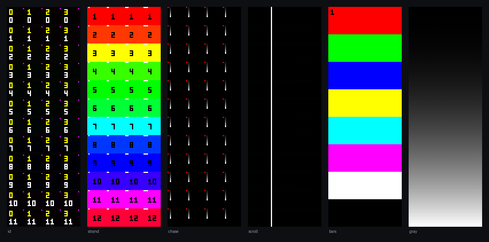

# Baybasi pixel wall

Software and firmware for a WS2812B video wall. The wall is 64 pixels wide and
192 pixels high. Each wall has 48 panels of 16 x 16 pixels.

There are two identical displays. The two displays do not share a cable, a
ground or a clock. Each display is a complete and independent system.

The software runs today without hardware. A software DDP sink receives the
pixel data and shows the result in a browser. You can test the driver and the
upload utility before the boards arrive.



---

## 1. The system

Each display contains these parts:

| Part | Quantity |
|---|---|
| Raspberry Pi 3 or newer, Pi OS Lite, headless | 1 |
| 8-port unmanaged switch | 1 |
| Controller board, one for each panel column | 4 |
| 16 x 16 WS2812B panel | 48 |

Each controller board holds an ESP32-S3-DevKitC-1, a WIZnet W5500 Ethernet
module and two SN74AHCT245N level shifters. Each board has 12 data outputs.
Each output drives one panel. The panels are not in a daisy chain. Thus one
strand has 256 LEDs and one frame needs 7.98 ms.

The Raspberry Pi holds all the geometry. A controller knows only the quantity
of bytes that it owns. All four controllers use the same firmware.

---

## 2. The contents of this repository

| Directory | Contents |
|---|---|
| `sw/` | The driver, the upload utility and the software DDP sink. Python. |
| `fw/` | The controller firmware. C++, PlatformIO, arduino-esp32 3.x. |
| `hw/` | The board design, the fabrication files and the enclosure. KiCad. |
| `HANDOFF-software.md` | The specification. |

`sw/README.md` and `fw/README.md` give more data about each part.

---

## 3. Before you start

You must have these programs:

- Python 3.9 or newer
- `ffmpeg` and `ffprobe`, on the PATH
- PlatformIO, but only to build the firmware

Install the software:

```bash
cd sw && python3 -m venv .venv && .venv/bin/pip install -e .
```

Make sure that the configuration is correct:

```bash
.venv/bin/baybasi check
```

The command shows the geometry and the wire budget. The command shows
`no problems found` if the configuration is correct.

---

## 4. Procedure: test the software without hardware

Do this procedure before the boards arrive. The procedure finds mapping errors
on a screen. You do not have to look at 8 feet of LEDs.

1. Start the software DDP sink in the first terminal:

   ```bash
   cd sw && .venv/bin/baybasi sink
   ```

2. Open `http://localhost:8088` in a browser.

3. Send a test pattern from the second terminal:

   ```bash
   cd sw && .venv/bin/baybasi pattern id --target 127.0.0.1
   ```

4. Look at the browser. Each of the 48 panels shows its own column number in
   yellow and its own row number in white. If a number is in the wrong
   position, correct the `panels:` list in `sw/config/wall.yaml`.

5. Send the other patterns. Refer to section 7.

6. Stop the pattern. Then start the driver and the upload utility:

   ```bash
   cd sw && .venv/bin/baybasi driver --target 127.0.0.1
   ```

   ```bash
   cd sw && .venv/bin/baybasi web
   ```

7. Open `http://localhost:8080`. Add a media file. Set the fit policy. Look at
   the preview.

**Caution: Do not send two patterns at the same time.** Two senders on UDP port
4048 cause torn frames. The sink shows a warning if this condition occurs.

---

## 5. Procedure: install on the Raspberry Pi

Do this procedure on each of the two Raspberry Pi computers.

```bash
sudo IFACE=eth0 PI_IP=192.168.50.1 ./sw/deploy/install.sh
```

The script does these tasks:

1. Installs Python, `ffmpeg` and `chrony`.
2. Installs the software in `/opt/baybasi`.
3. Puts the media library in `/var/lib/baybasi`.
4. Sets the wired interface to `192.168.50.1/24`.
5. Sets `ipv4.never-default yes` on that interface.
6. Starts the driver and the upload utility as services.

**The LED network must not become the default route.** The LED network has no
connection to the internet. If the LED network becomes the default route, the
Raspberry Pi loses DNS and NTP. NTP keeps the two displays in step.

---

## 6. Procedure: flash and commission a board

**Warning: Flash each board on the bench. Do not flash a board that is in a
controller.** A devkit in a controller with USB power sends 5 V out through the
power terminal. The 5 V can energize the panel column.

**Note:** Many USB-A to USB-C cables supply power only. Such a cable makes the
devkit port look defective. If the devkit does not show on the USB bus, replace
the cable first.

1. Connect the devkit to the computer with a USB-C data cable.

2. Build and flash the firmware:

   ```bash
   cd fw && pio run -t upload
   ```

3. Flash all 10 devkits at the same session. Then install the devkits in the
   controllers.

4. Connect the controller to the switch. Apply power.

5. Find the board on the Raspberry Pi:

   ```bash
   baybasi discover
   ```

   The board shows its factory MAC address. The column is empty.

6. Give the board its column:

   ```bash
   baybasi assign aa:bb:cc:dd:ee:ff 2
   ```

   The board writes the column to NVS. Then the board restarts. The board keeps
   the column after an update.

7. Do steps 4 to 6 for each of the four boards.

After the first flash, use the network for all subsequent updates:

```bash
baybasi ota .pio/build/baybasi-ctrl/firmware.bin --pi-ip 192.168.50.1
```

If an update fails, remove the devkit from its sockets. Then install a
different devkit.

---

## 7. The test patterns

```bash
baybasi pattern <name> --target 127.0.0.1
```

| Name | Function | What you must see |
|---|---|---|
| `id` | Panel identification | Each panel shows its column and its row. |
| `strand` | Output identification | Each output has a different colour. |
| `chase` | LED chain | A comet moves smoothly along the chain. |
| `scroll` | Frame synchronization | A white column moves across the wall. The line does not break at the column seams. |
| `bars` | Colour order | The top band is red. |
| `gray` | Gamma and dither | A smooth ramp. There are no bands. |
| `solid` | Power supply | A flat colour. |

`scroll` is the most important pattern. Only `scroll` shows a synchronization
error between the four controllers.

**Caution: `solid` at full white causes the maximum current.** Do not use
`solid` at full white before the power injection is correct.

---

## 8. Configuration

`sw/config/wall.yaml` holds all the geometry. The file is data and not code.
You can correct an error in the wall with a text editor. You do not have to
change the Python code.

The file contains these items:

| Item | Function |
|---|---|
| `panel.chain` | The sequence of the 256 LEDs in one panel. |
| `controllers[].panels` | The wall row that each output drives. |
| `transform` | The rotation of one panel. Use this for a panel that is upside down. |
| `color_order` | The channel sequence on the network. |
| `render` | The frame rate, the gamma, the brightness and the epoch. |
| `network` | The addresses, the port and the packet size. |

Example: row 7 of column 2 shows the picture of row 8. To correct this error,
change two lines in the `panels:` list. Then restart the driver.

---

## 9. The status LED

The status LED is the only indication that you can see when the board is behind
a panel.

| Colour | Condition |
|---|---|
| Red | The board is in the start sequence. |
| Red, slow flash | There is no Ethernet link. |
| Amber | The link is up. There are no pixels for more than 500 ms. |
| Blue | The board receives data. The outputs are off. |
| Green, slow pulse | The board operates correctly. |
| Magenta | The frames are not complete. |
| White, pulse | An update is in progress. |
| White, fast flash | The operator sent a Find command. |
| Red, fast flash | There is a fault. Read the serial log. |

---

## 10. Keep the two displays in step

No messages go between the two displays. Each Raspberry Pi calculates the frame
number from the time of day:

```python
frame_index = int((time.time() - EPOCH) * FPS) % n_frames
```

Thus the two displays agree only if the two playlists are the same. The
playlist compiles to a frame timeline. The manifest digest is a hash of that
timeline.

Procedure:

1. Upload the same media to the first Raspberry Pi.
2. Upload the same media to the second Raspberry Pi.
3. Download the manifest from the second Raspberry Pi.
4. Use the **Compare** button on the first Raspberry Pi.

If the two digests agree, the two walls show the same content. If the two
digests do not agree, the utility gives the reason:

```
$ baybasi manifest --compare pi-b.json
DIFFERS:
  sunset.jpg: fit letterbox vs crop
  same media, different playlist order
```

The `EPOCH` value in `wall.yaml` must be the same on the two computers. The
`wall_digest` value must also be the same.

---

## 11. Troubleshooting

| Symptom | Cause | Correction |
|---|---|---|
| The sink shows torn frames and a high gap count. | Two senders transmit on port 4048. | Stop the other `baybasi pattern` or `baybasi driver`. |
| The wall shows noise at power-up. | The level shifters became active too soon. | Measure GPIO 8. GPIO 8 must stay high until the first complete frame. Check R15 to the 3V3E rail. |
| The wall keeps one picture after a fault. | The controller still receives packets. | Look at the driver log. A controller goes to black 500 ms after the last packet. |
| Red and green are not correct. | The Pi and the firmware both change the channel order. | Set `LED_ORDER_GRB` to 0 in `fw/src/config.h`. Refer to section 12. |
| The driver reports dropped frames. | The Raspberry Pi cannot do the work in time. | Read the stage times in `baybasi status`. The slowest stage is the cause. |
| The board does not show in `baybasi discover`. | There is no link, or the board has no address. | Look at the status LED. A red flash shows that there is no link. |
| The two walls do not agree. | The playlists are different. | Compare the manifests. Refer to section 10. |

---

## 12. Two decisions that the specification did not make

**The network carries RGB. The firmware changes the sequence to GRB.** The
WS2812B is a GRB device, but that is a property of the LED and not of the
network. The DDP data-type byte declares RGB. Thus a GRB payload would give
incorrect data to Wireshark and to other DDP tools.

One flag controls each side: `color_order` in `wall.yaml`, and `LED_ORDER_GRB`
in `fw/src/config.h`. Only one of the two must change the sequence. The `bars`
pattern shows which condition is true. The top band must be red.

**Each controller has its own DDP destination identifier, 10 to 13.** The four
boards are still different only by IP address. The identifier comes from the
column number. The firmware also accepts identifier 1 and identifier 255. The
byte counts do not change.

The identifier gives two advantages. One software sink on one computer can
replace four boards on four addresses. A packet that goes to the incorrect
board is rejected and not shown.

---

## 13. Tests

Python, 70 tests:

```bash
cd sw && .venv/bin/python -m pytest tests -q
```

Firmware logic, 20 tests. The tests run on the host computer:

```bash
cd fw && clang++ -std=c++17 -O1 -g -fsanitize=thread -I test/shim \
    -o /tmp/fwtest test/test_framebuf.cpp src/framebuf.cpp && /tmp/fwtest
```

---

## 14. The condition of this project

The software is complete and tested. A measured run gives 30.0 frames each
second with 0 torn frames and 0 protocol errors. The Raspberry Pi work is
3.0 ms of the 33.3 ms budget.

The firmware is complete but **no person has flashed the firmware to a board**.
The boards are in fabrication. Only the frame assembler is proven. The frame
assembler compiles on the host computer and passes the thread tests.

These items are not proven:

- The Ethernet start sequence
- The `/OE` sequence at power-up
- The update through the network
- The LED library with the 12 pins of the board

Do these three checks first at the bench:

1. The serial log shows the factory MAC address and a successful `ETH.begin`.
2. `baybasi discover` finds the board.
3. `baybasi pattern bars` lights the panels. The top band is red. There is no
   flash at power-up.
