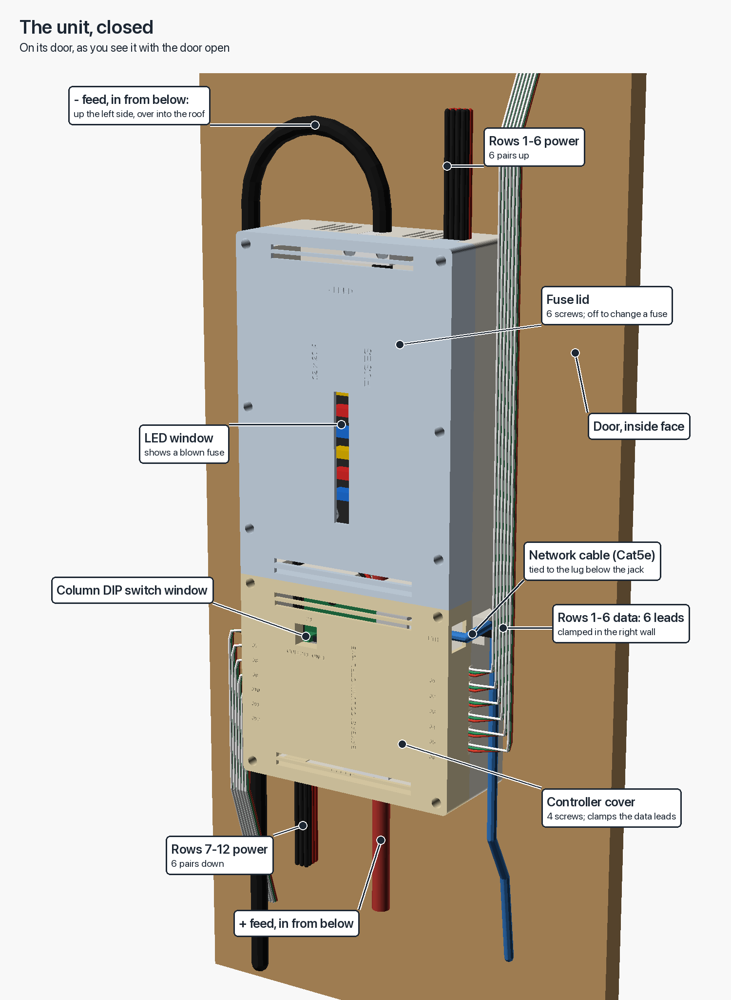
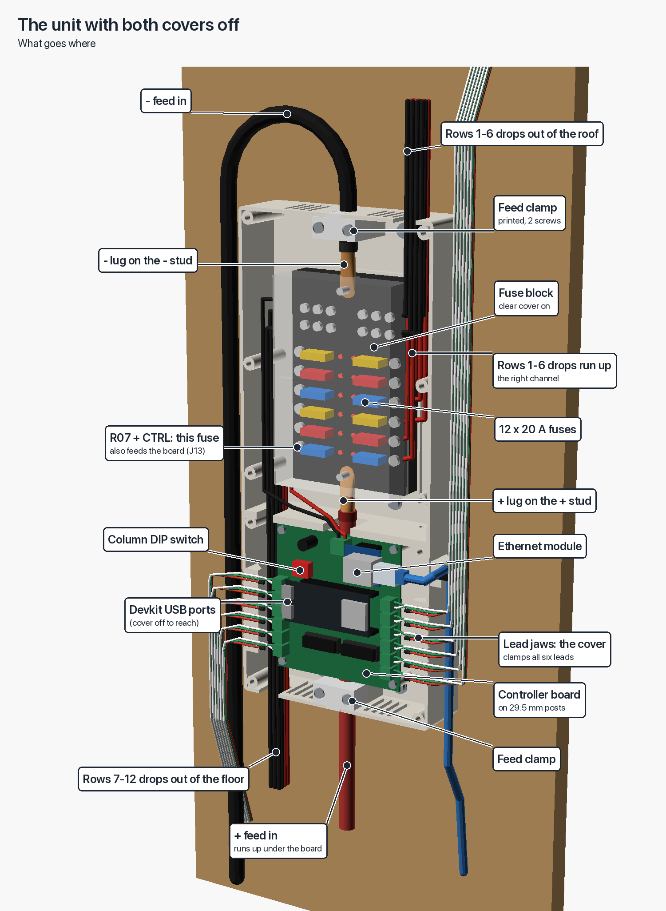
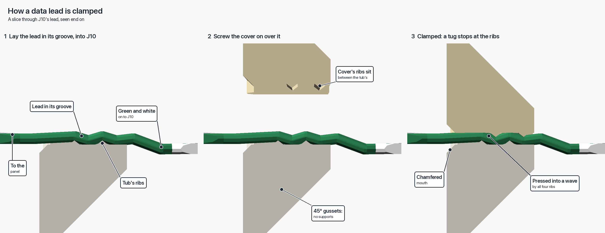
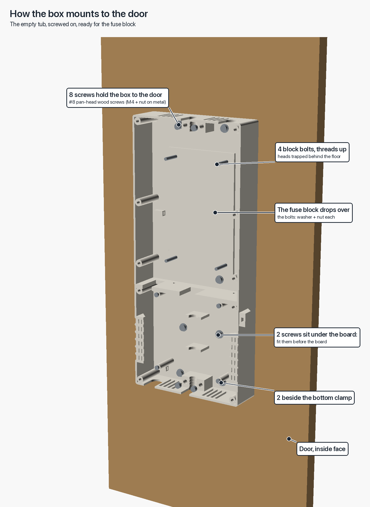
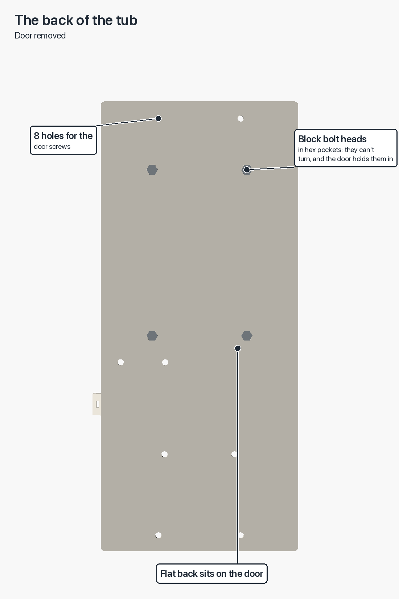
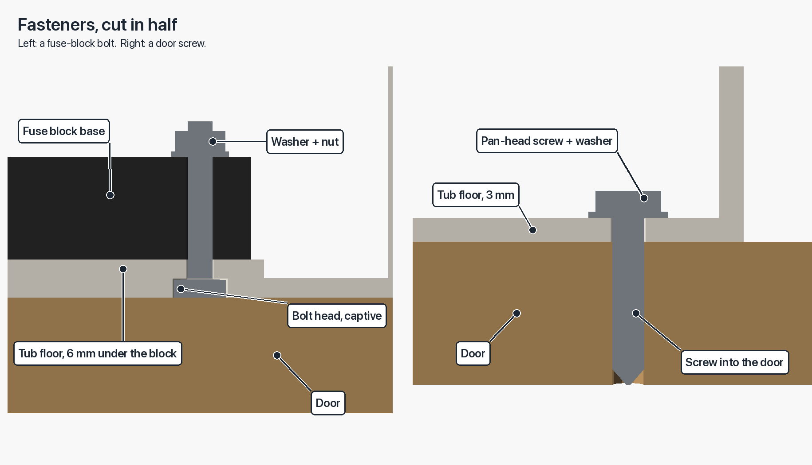
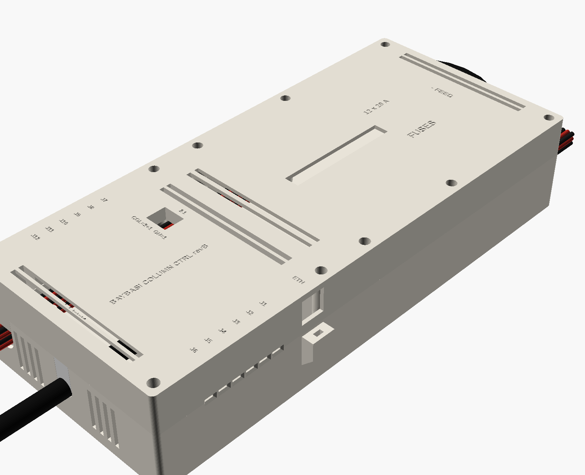
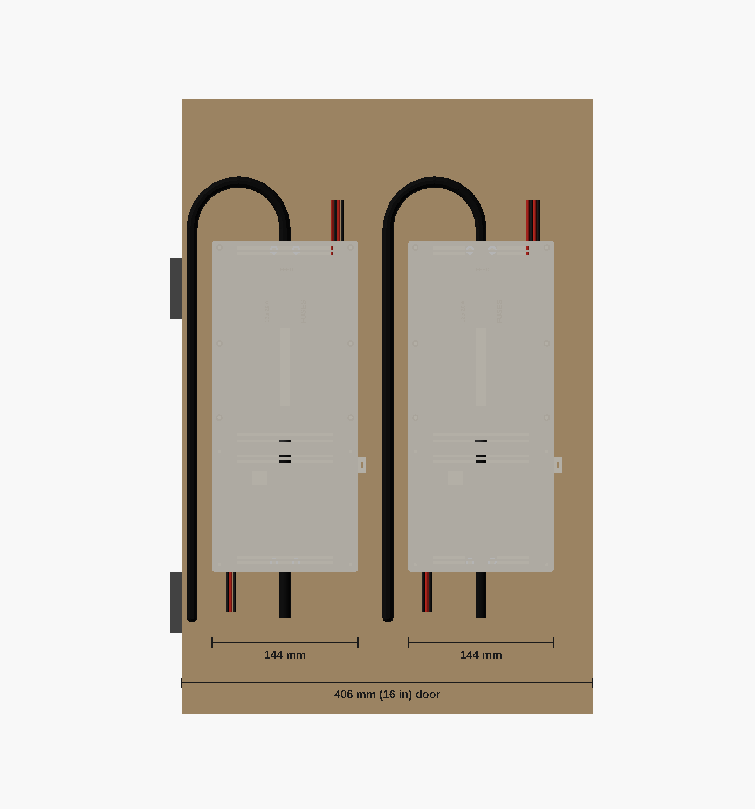

# Per-column unit enclosure, rev B

One printed box per column holds the 12-way fused block and the column
controller, block above board, on the inside of a hinged door. Four make a
display, two to a 16 in door. Source: [enclosure.scad](enclosure.scad).
Outputs: [enclosure/](enclosure/), regenerated by
[export_enclosure.sh](export_enclosure.sh), which also runs
[annotate_enclosure.py](annotate_enclosure.py) to label the illustrations.

**Box: 144 wide x 328 tall x 65 deep (mm).** Two fit a 406 mm door with
118 mm to spare. Allow about 430 mm of door height, which covers the box plus
the feed bends above and below it.

## Illustrations

The unit as you'll meet it, standing on its door, with the lid and cover on and
off. The coloured parts inside and the cables are stand-ins; the lid and cover
are tinted only so you can tell them apart. In OpenSCAD, pick `illus_closed`,
`illus_open`, `illus_lead` or `illus_mount` from the `part` dropdown to turn
any of these round yourself.

### How the data leads are held

Each panel's data lead is wired straight into its terminal, J1-J12, as the
shopping list plans. There is no connector at the box. The lead's box end is
cut off, green (data) and white (ground) go into the terminal, and red, the
panel's own 5 V, is cut back at both ends under heat-shrink. Three things
keep a tug off the terminal:

1. **Ribbed jaws in the wall.** Each lead lies flat in a groove at the
   tub/cover joint. The cover's ribs sit between the tub's, so its four
   screws press all six leads on a side into a slight wave. A tug would have
   to drag the lead through the wave.
2. **A P-clip on the door**, within about 10 cm of the box, for each side's
   six leads. E-2 already asks for a clamp on both sides of the hinge. This
   one also holds the leads while the cover is off.
3. **Slack inside**: a small bow between the jaws and the terminal.

You unplug a panel at the panel end, where the lead's own latch is, the same
as its power drop. Rev A held a JST housing in the wall instead. Whichever
half sat there, either its lock was out of reach inside the box or the leads
needed crimping male at both ends, so it is gone.

### How the box mounts to the door

The tub, the back half, screws flat to the inside face of the door with 8
screws through its 3 mm floor, into 4.5 mm holes: two by the roof clamp, two
in the gallery above the divider, two under the board and two by the floor
clamp. For the split tub, four are in each half. Fit them before anything
goes in the box, because two end up under the board. The covers screw to the
tub separately, so the tub never comes off the door to change a fuse or reach
the board.

| Door | Door screws, 8 per box |
|---|---|
| 3/4 in wood or plywood | #8 x 5/8 in pan-head wood screw. About 12 mm bites into the door and 7 mm stays behind it |
| 1/2 in wood or plywood | #8 x 1/2 in pan-head wood screw |
| sheet steel, 1-2 mm | #8 x 1/2 in pan-head sheet-metal screw into a 3.2 mm pilot hole, or M4 x 10 pan head with a nut behind |
| hollow-core | a plywood backer panel glued and screwed to the door first; the skin alone won't hold a screw |

A screw should reach no further than 3 mm (the floor) plus about two thirds
of the door's thickness. The loaded unit weighs about 1.5 kg, so eight #8s
are far more than it needs.

The fuse block has its own four M4 bolts. Their hex heads sit in pockets in the
back of the floor, trapped between the tub and the door so they can't turn, with
the threads standing up through the floor. The block drops over them and takes
a washer and nut on each.

**Closing it up.** The controller cover takes 4 M3 x 12 socket-head screws and
the fuse lid takes 6, all into brass heat-set inserts in the tub's corner
bosses. The screw heads sit at the bottom of 6.5 mm counterbores, so use a
2.5 mm hex key with a long arm. Fit the cover first. Its jaws clamp the data
leads and its tongue closes the floor drop slot, so before it goes on each
lead should lie flat in its labelled groove, and the rows 7-12 drops should
be tied down in the bottom of the floor slot. The lid's tongue does the same
for the rows 1-6 drops in the roof slot. Tighten each screw until its cover
sits flat on the tub all round, then stop. The grip on the leads and drops is
set by the geometry, not by torque, and a brass insert in PETG strips if you
lean on it.

### More views

## Design decisions

**The block stands on end, - end up.** DAIER's drawings of the FB-1714 put
the + and - studs on the centreline at opposite ends. The block's own cover
lets a cable reach a stud only through a notch in that end wall, so each 6 AWG
lug must point straight out along the block's axis. E-1 draws the block lying
across the box. That puts both feeds out through the side walls. Block, lug,
heat-shrink and clamp at each end come to 215 mm of box before either cable
turns, so two do not fit on the door.
Standing the block on end, the - feed drops straight in through the roof and
the + feed comes straight up through the floor. Neither cable bends inside the
box. Both come from the supply at the foot of the wall, so the - climbs the
left side of the box and bends over into the roof clamp. At the 45 mm minimum
radius that takes about 26 mm beside the box and 60 mm above it. The rows 1-6
drops leave the right of the roof, clear of the bend.

**The + feed runs under the board.** The board sits below the block, so the
+ cable passes under it on the centreline. The board stands on 29.5 mm posts
to clear it. **That sets the box depth, not the block**:
`blk_lug_z` + half the cable + 2 mm + the board's solder tails. The depth
moves 1:1 with `blk_lug_z`, which answers the "enclosure depth" open item on
the electrical sheet once you measure it.

**The board turns 90 degrees clockwise.** J13 faces up, towards the block that
feeds it, about 40 mm from the + stud. J1-J6 and the RJ45 face the
right wall, and J7-J12 and the devkit's USB face the left wall.

**Half the column goes up, half down (E-3).** The right half of the box serves
rows 1-6. The right fuse column's six drops and the six negative screws on
that side go up the right channel and out of the roof slot, and J1-J6's leads
leave the right wall and turn up. The left half serves rows 7-12. Its drops
go down the left channel, through a notch in the divider, past the board
between the cover's corner screw and the board's post, and out of a floor slot
beside the + clamp. J7-J12's leads leave the left wall and turn down. Power
leaves the ends and data the sides, so the looms part at the box (E-3 note 3).
Label the fuses to match. R07 is the left column's bottom fuse, the one
nearest J13.

**The controller shares fuse R07.** E-1 doubles the board's 5 V onto R07's
output screw, a 14 AWG ring over the drop's ring, instead of giving it its own
5 A inline fuse. So the gallery no longer holds a tap holder. Label the fuse
`R07 + CTRL`.

**Two front covers.** The fuse **lid** (6 screws) covers the block, the
gallery and the roof clamp, and a tongue on it closes the roof drop slot. The
controller **cover** (4 screws) clamps the twelve data leads, and its tongue
closes the floor drop slot. A fuse change never unclamps a data lead, and the
box never comes off the door.

**Feeds are clamped to the tub, not to a cover.** Each feed gets a split
saddle clamp: half in the tub, half a separate printed part held by 2 x M4. Its
bore is `feed_od - 0.8` with three ridges, and the clamp bottoms out on the
cradle, so the grip is set by geometry rather than by torque. The wall
opening has a bell mouth. The flexing belongs in the hinge loop, so also
P-clip each feed to the door 100-150 mm outside the box (E-2's "clamp on
both sides").

**Drops**: twelve wires a side, tied at two anchors each, and each slot is
closed over its bundle by a tongue on the lid (roof) or the cover (floor).
**Data**: six leads a side in ribbed jaws at the joint, labelled J1-J12 on
the cover. **Cat5e**: the lead plugs straight into the module through
the right wall, turns down the side, and a cable tie through the lug below the
opening holds it. (Rev A's tie block sat flat on the mounting surface with its
slot along the cable, so a tie couldn't go round the lead. The lug replaces it.)

**USB is reached by taking the cover off, not through a wall port.** A wall
port was designed and dropped. The devkit is a third-party board whose USB
position is unmeasured, the port would crowd J7-J12's leads out of the left
wall, and README section 6 says not to flash in a controller at all. With the
cover off, a USB-C plug reaches the devkit over J7-J9 and over the tub's low
wall without removing the board. See "Reflashing in place" below.

**The DIP switch is set through a window** in the cover. It is about 25 mm
down, so set it with a pick. Poles run right to left: 1, 2, SP, SP. Read ON from the
switch body; KiCad's footprint puts ON towards the bottom of the box, but
that is its convention, not the part's.

**Venting.** Slots in the floor and roof walls either side of each clamp, and
rows across both faces top and bottom. Air comes in low and leaves high on a
vertical door. The LED slot in the lid shows the blown-fuse LEDs with the lid
on.

**The tub prints in two halves.** They split at the divider between lid and
cover, each half fits a 220 mm bed, and they join with 2 x M3 through the
divider. Each half also has its own door screws. `part="tub"` is the one-piece
version, for a 330 mm bed.

## Measure before printing

The block's dimensions come from DAIER's own FB-1714 drawings: the
[dimensioned drawing](https://www.daierswitches.com/cdn/shop/products/FB-1714DimensionedDrawing_1600x.jpg)
and the [product size sheet](https://www.daierswitches.com/cdn/shop/files/FB-171412-WayBladeFuseBlockSize_1600x.jpg).
The two sheets disagree by up to 2 mm. A reseller
[listing](https://carkart.com/products/daiertek-12-way-fuse-block-12-volt-blade-fuse-block-with-led-indicator-12-circuit-fuse-box-12v-ato-atc-marine-fuse-panel-24v-wi)
identifies the DaierTek Amazon block as FB-1714, but the part in hand has not
been checked. **Treat every value below as a guess until measured.**

| Parameter | Default | Source | What it moves |
|---|---|---|---|
| `blk_lug_z` | 16 | estimated from DAIER's end view | **Box depth, 1:1.** Fit a 6 AWG lug on a stud; measure mounting face to barrel axis |
| `blk_l`, `blk_w` | 137.7, 85.1 | DAIER size sheet (138.25, 85.0 on the drawing) | box height, channel width |
| `blk_w_cover` | 88.0 | DAIER drawing | channel width |
| `blk_h` | 36.5 | DAIER drawing (35.7 on the size sheet) | assert against the lid |
| `blk_hole_px`, `blk_hole_py` | 121.0, 69.1 | DAIER size sheet; 123.25 x 70 on the drawing may be the back screws | the four block bolts. **Check on the template** |
| `blk_stud_in` | 8.35 | in line with the holes on both sheets | where the lugs sit |
| `lug_reach` | 16 | 6 AWG ring lug for M5: ~30 long less the stud's inset | gallery and roof zone height |
| `feed_od` | 11.0 | brief | clamp bore and wall slot |
| `pcb_pins` | 3.0 | assumed | board post height, depth 1:1 |
| `dk_usb_by` | 80.5 | silkscreen outline (third-party devkit) | ghost only; check the plug clears J7-J9 |
| `lead_w`, `lead_t` | 5.2, 1.7 | typical flat 3 x 22 AWG LED lead | the jaw grooves. **Calipers on one of the leads** |
| `lead_bite` | 0.6 | guess | how hard the jaws grip. **Coupon check 1** |
| `rj45_h`, `sock_h`, `hdr_spacer` | 13.5, 8.5, 2.5 | rev A, BOM, FABRICATION.md | depth, Ethernet opening |
| block bolt length | M4 x 25 | DAIER's end view shows the holes through the whole ~16 mm base; plus 3 mm of floor, washer, nut | measure the base thickness at its holes; add any extra to the bolt |

Asserts in the SCAD stop the build if a measurement makes two printed
features collide, or leaves the rows 7-12 drops no room past the board.
`openscad` echoes the box size on every run.

## Coupon and template first

Print `coupon.stl`, `template.stl` and one `clamp.stl` (about 1.5 h in
total) before the tub, which takes a day.

1. **Lead clamp.** Two insert-and-screw jaw pieces, a strip of the side wall
   each. Lay a real data lead flat in a groove, screw the halves together, and
   hang a full gallon jug of water (about 4 kg) from the lead for a minute.
   It must not creep. If it does, raise `lead_bite` by 0.2. If the lead won't
   lie flat in its groove, set `lead_w` and `lead_t` from calipers.
2. **Inserts.** Seat an M3 and an M4 heat-set insert. Adjust `m3_insert` /
   `m4_insert` if they are loose or crack the boss.
3. **Block bolt.** An M4 hex bolt head must drop into the pocket from below
   without turning.
4. **Feed clamp.** Screw the clamp onto the cradle over an offcut of the real
   6 AWG. It should grip hard enough that you cannot pull the cable through by
   hand. Adjust `feed_od` or `feed_squeeze`.
5. **Template.** Stand the block on it. All four bolt holes and the outline
   must line up, and each stud must sit on the spine running past each end.

## Print settings

PETG, not PLA: the box lives next to 60 A joints on a warm wall, and PLA
creeps under heat-set inserts. 0.4 mm nozzle, 0.2 mm layers, 4 perimeters,
5 top and 5 bottom layers, 20-25 % gyroid infill. **No supports on any
part**, and every STL is exported already in its print orientation:

| Part | Qty | Orientation | Bed | ~Time* |
|---|---|---|---|---|
| `tub-upper.stl` | 1 | floor down | 144 x 204 | 10 h |
| `tub-lower.stl` | 1 | floor down | 153 x 124 | 8 h |
| `lid.stl` | 1 | face down | 144 x 204 | 6 h |
| `cover.stl` | 1 | face down | 144 x 124 | 5 h |
| `clamp.stl` | 2 | clamping face up | 32 x 17 | 0.3 h |
| `coupon.stl`, `template.stl` | 1 | as exported | | 1 h |
| `tub.stl` (instead of the halves) | 1 | floor down | 153 x 328 | 18 h |

\*Scaled from rev A's 8 h box by volume. About 30 h and 750 g of PETG per
unit, or 240 h for all eight.

## Hardware, per unit

| | Qty |
|---|---|
| M3 x 5.7 heat-set insert | 16: 4 board posts, 4 cover, 6 lid, 2 tub joint |
| M4 heat-set insert, ~5.6 OD | 4: feed clamps |
| M3 x 12 socket head | 10: lid 6, cover 4 |
| M3 x 8 socket head | 2: tub joint, split tub only (a 12 would bottom out) |
| M3 x 6 pan head | 4: board to posts |
| M4 x 20 socket head | 4: feed clamps |
| M4 x 25 hex bolt (DIN 933), nut, washer | 4: block; length per the table above |
| #8 pan-head screw, length and type by door (table above) | 8: box to door |
| cable tie, up to 3.6 mm wide | 5: four on the drops, one on the Cat5e |
| screw-mount P-clip, 3/8 in (E-1's stock) | 2: one per side for the data leads, near the box |
| 22 AWG bootlace ferrule | 24: green and white of each data lead |
| heat-shrink, ~2.5 mm bore | 24: each red conductor, cut at both ends |

Installing the heat-set inserts uses an iron as a heat tool only. Every
electrical joint is still a crimp or a screw terminal.

## Assembly order

1. Press all the heat-set inserts in. For the split tub, the joint inserts go
   into `tub-lower` from its split face.
2. Drop the four M4 hex bolts into the pockets under the block seat, threads
   up. The door will hold them captive; tape them for now.
3. Split tub only: butt the halves at the divider and fit the two M3 joint
   screws from the gallery side.
4. **Mount the empty tub on the door** with its 8 screws. Two of them sit
   under the board, so they have to go in first.
5. Lower the block over the bolts, - end up, and fit washers and nuts.
6. **+ feed:** lay it into the floor slot and along the guides under the board
   position. Land the 6 AWG lug on the + stud and screw the floor clamp down.
7. **- feed:** lay it into the roof slot, land the lug on the - stud, and screw
   the roof clamp down.
8. Mount the board on its posts with J13 at the top. Its tails clear the
   + feed by 2 mm, so check that nothing sags onto them.
9. Drops: crimp and land them on the block. **Rows 1-6**, the right fuse
   column and the right six negative screws: up the right channel and out of
   the roof slot. **Rows 7-12**, the left column and the left negatives: down
   the left channel, through the divider notch, past the board on its left
   and out of the floor slot. Tie each bundle at both of its anchors.
10. Controller 5 V (E-1): stack the 14 AWG tap's ring on R07's output screw,
    over the drop's ring, and run it through the divider notch to J13+. Run
    J13- to a negative-bus screw the same way.
11. Data: cut each lead's box end off. Cut red back at both ends and
    heat-shrink the stubs, because it is the panel's live 5 V. Ferrule green
    and white, lay the lead flat in its groove as labelled on the cover
    (J7-J12 left, J1-J6 right), leave a small bow, and screw it into its
    terminal, data on the square pad (FABRICATION.md). Set the DIP switch.
12. Fit the cover (it clamps the leads) and the lid. Plug in the Cat5e and tie
    it below the opening.
13. Outside the box: bring the pair in from below. The + goes straight up into
    the floor clamp. The - runs up the left side of the box and bends over
    into the roof clamp, radius at least 45 mm. P-clip both to the door. Then
    P-clip each side's data leads within about 10 cm of the box, rows 1-6
    turning up the right side and rows 7-12 down the left.

**Changing a fuse:** remove the lid's 6 screws, then press the block cover's
latches and lift it off. All 12 fuses are there. R07's also feeds the controller.
Spares and the puller live in the pocket on the inside of the lid.

**Reflashing in place:** README section 6 says to flash on the bench, because
USB back-feeds the column through the board (FABRICATION.md, "known,
accepted"). If you must flash in place, **pull fuse R07 first**. That
isolates J13 from the block, so USB powers only the controller, and panel R07
goes dark until you refit it. Then take the cover off and plug in. The data
leads stay put in their grooves, held by the P-clips outside.

## Open

- **Door height** is not fixed yet. The unit needs about 430 mm including its
  feed bends.
- **The depth is 65 mm until `blk_lug_z` is measured.** Confirm the bay
  clears it with the door shut.
- **Door spacing.** Each unit needs about 26 mm clear on its left for the
  - feed and about 20 mm on its right for the rows 1-6 leads and the Cat5e.
  So place the boxes 30 mm from the hinge edge and 50 mm apart, which leaves
  38 mm at the free edge. On door 2, whose hinge is on the right, the 38 mm
  gap is at the hinge. The enc-door render shows this spacing. Check it
  against the real door and hinge.
- **Data lead size.** `lead_w` and `lead_t` are guesses for the shopping
  list's flat 3 x 22 AWG leads.
- DAIER's page lists the 24 small terminals as **M4 threaded studs**. If they
  take ring or fork terminals rather than ferrules, those lugs are longer, so
  check they still turn up inside the 24 mm channels (`side_ch`).
